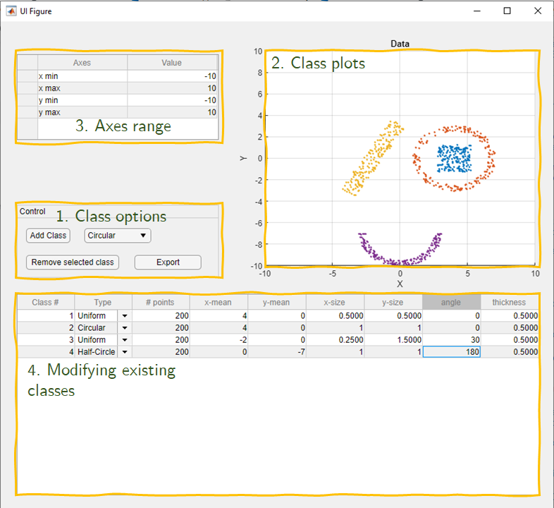

# Matlab-Utilities
 MATLAB utilities that support in testing and running data science and machine learning algorithms
## Generate 2D data
A MATLAB utility that is used to generate 2D classes of various shapes. It is written using MATLAB's app designer, and requires the statistical toolbox.

### How To Use
* Choose the class type in the dropdown in __Class options__. Current options are:
1. Gaussian
2. Uniform
3. Circular
4. Half-circle
* Click on the __Add Class__ button. A class with default properties will be created and can be seen in __Class plots__. __NOTE: The app now only supports 7 different classes.__
* The range of the plot can be modified in __Axes range__ section. This does not affect the generated classes, only changes the axes view
* To modify the generated class properties, use the __Modifying existing classes__ table. Properties you can modify are:
1. Class #: After data is generated, the class it belongs to can be changed. This way you can create complex shaped classes
2. Type: Data can be re-generated from a different distribution, just change the type from the dropdown menu
3. # points: By default, a class is generated from 200 points, this can be modified
4. x-mean, y-mean: Default is 0, can be modified from here
5. x-size, y-size: Default is 0.5. Size means:
    1. Gaussian: standard deviation
    2. Uniform: x2.5 length in x or y direction
    3. Circular: x2.5 radius in x or y direction
    4. Half-Circle: x2.5 radius in x or y direction
6. Angle: Rotation angle, clockwise, in degrees
7. Thickness: Only affects __Circular__ or __Half-Circle__.
